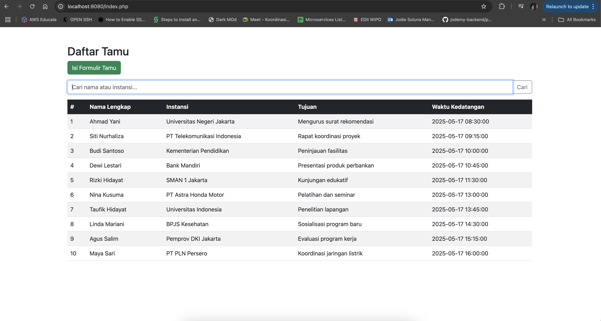
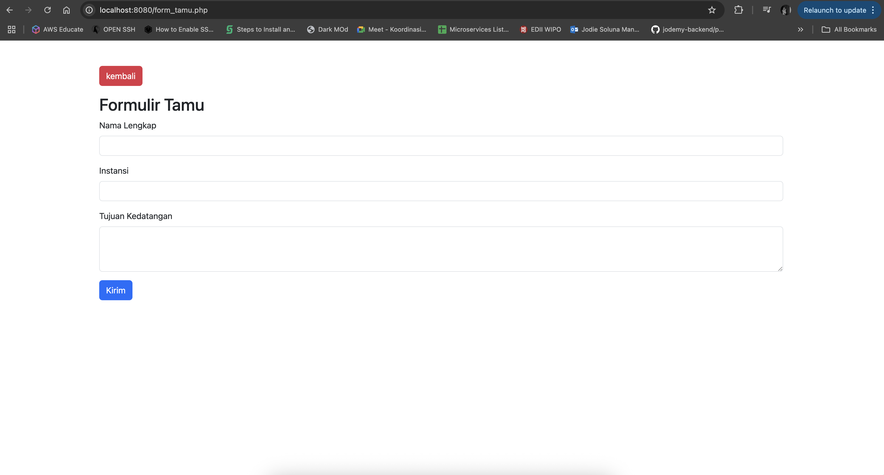

# UTS WEB 2


> ### Personal Information
> * Nama: Jodie Soluna Manopo
> * NIM: 230401010196
> * Kelas: IF402
> * Prodi: PJJ Informatika
> * Matkul: Pemrograman WEB 2
> * Type: UTS

## CRUD PHP Daftar Tamu
Aplikasi berbasis web ini dibuat untuk memenuhi UTS WEB 2. Aplikasi ini merupakan aplikasi yang mencakup fitur (create, read) dari sebuah Daftar tamu.

### I. Mysqli Procedural Style
---
mysqli procedural style adalah sebuah gaya penulisan secara prosedural yang diperuntukan dalam pembuatan aplikasi kecil. Saya menggunakan mysqli procedural style dikarenakan aplikasinya kecil hanya untuk fitur create dan read dari tabel buku_tamu dan semua penulisan php yang saya terapkan secara prosedural sehingga lebih mudah dan lebih ringkas.

### II. Struktur Database
---
Queries
```sql
CREATE TABLE buku_tamu (
    id INT AUTO_INCREMENT PRIMARY KEY,
    nama_lengkap VARCHAR(100),
    instansi VARCHAR(100),
    tujuan TEXT,
    waktu_kedatangan DATETIME DEFAULT CURRENT_TIMESTAMP
) ENGINE=InnoDB DEFAULT CHARSET=utf8mb4;
```

### III. Alur Aplikasi
---
1. index.php -> file utama yang akan diakses pertama kali oleh browser yang berisikan tampilan view untuk table daftar tamu.
2. koneksi.php -> file untuk konfigurasi koneksi database (file ini menerapkan konsep reusable yang nantinya akan digunakan setiap kali kita membutuhkan koneksi database).
3. Daftar Aksi
    1. CREATE
        - form_tamu.php [GET][handler] -> merupakan file yang berisikan form untuk membuat data tamu baru (insert) yang nantinya akan melakukan aksi POST ke [form_tamu.php]
        - form_tamu.php [POST][handler] -> merupakan file yang berisikan aksi query untuk insert dari data yang sudah didapat dari parameter yang disediakan.
    2. READ
        - index.php [GET][handler] -> merupakan file yang berisikan tabel daftar tamu. Pada method GET ini juga menyediakan fitur search yang di masukan kedalam parameter search yang nantinya bisa digunakan untuk mencari data tamu berdasarkan nama lengkap ataupun instansi tertentu
### IV. SCREENSHOT
---
1. daftar_tamu.php
    
---
2. form_tamu
    
---
## HOW TO USE
### 1. Restore database
---
```console
   foo@bar:~$ sudo mysql -u db_username -p db_name < backup.sql
```
### 2. Setup Database Config
---
```console
    foo@bar:~$ sudo nano koneksi.php
```

> **EXAMPLE**
>
> *filename* : **koneksi.php**
>
>   ```php
>    $username ="root";
>    $password="";
>    $host="localhost";
>    $db = "unsia"; 
>   ```


### 3. Run Program
---
```console
   foo@bar:~$ php -S 127.0.0.1:8080
```
